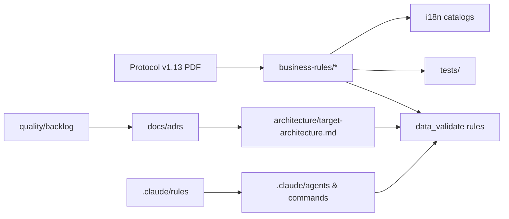

# Specifications — data_validate (Canoa)

`.specs/` is the written source of truth for **what** the validator must do, **how** it is built
today, **where** it is going, and **why** decisions were taken. Code, `.claude/rules/` and these
specs are kept in sync on every change (see `.claude/rules/spec-sync.md`).

## Map

| Folder | Answers | Start with |
|---|---|---|
| `00-overview.md` | What is the project, for whom, glossary | — |
| `architecture/` | How the pipeline works today, target design, data flow, error model, module map | `current-architecture.md` → `target-architecture.md` |
| `api/` | CLI contract, Python API, report formats | `cli-contract.md` |
| `business-rules/` | Every validation rule with a stable ID, traced protocol → code → test → message | `business-rules/README.md` |
| `use-cases/` | Actors and end-to-end scenarios | `use-cases/README.md` |
| `quality/` | Testing strategy, security, performance, code quality, **backlog** | `quality/backlog/README.md` |
| `infrastructure/` | CI/CD, packaging, dependencies, environments | `infrastructure/ci-cd.md` |
| `frontend/` | The HTML/PDF report UI | `frontend/report-ui.md` |
| `i18n/` | Message catalogs | `i18n/catalog.md` |
| `future/` | Ideas, deprecations, open questions | `future/deprecations.md` |
| `templates/` | Templates for specs, rules, use cases, ADRs, backlog items, agent briefs | — |

Architecture decisions live in [`docs/adrs/`](../docs/adrs/README.md). Working rules for humans
and agents live in [`.claude/rules/`](../.claude/rules/). Agents, commands and skills are under
[`.claude/`](../.claude/).

## Identifier conventions

| Kind | Pattern | Example | Defined in |
|---|---|---|---|
| Business rule | `<SHEET>-<NNN>` with sheet prefix `STRUCT, DESC, COMP, VAL, TEMP, SCEN, LEG, PROP, SPELL` | `DESC-004` | `business-rules/` |
| Backlog item | `<AREA>-<NNN>` with area `BUG, SEC, ARC, TST, PERF, TOOL, DOC` | `SEC-001` | `quality/backlog/` |
| ADR | `NNNN-<slug>.md` | `0004-structured-issue-model.md` | `docs/adrs/` |
| Use case | `UC-NN-<slug>.md` | `UC-01-validate-bundle.md` | `use-cases/` |
| Message key (target) | `<area>.<RULE-ID>.<kind>` | `rule.DESC-004.error` | `i18n/catalog.md` |

IDs are stable and never renumbered. A rule ID appears in the spec, in the code (`Rule.rule_id`),
in the test name, in the message key and in the report.

## How the pieces link

## Editing rules

- Every spec ends with `Last synced with code: <short sha>`; update it when the spec is
  re-verified against the code.
- Prefer tables and diagrams over prose; name files, classes and functions exactly.
- Unknowns go to `future/open-questions.md`, never as placeholders inside a spec.
- New conventions agreed in conversation become a rule in `.claude/rules/` or a section here in
  the same commit.

Last synced with code: 09279f4
