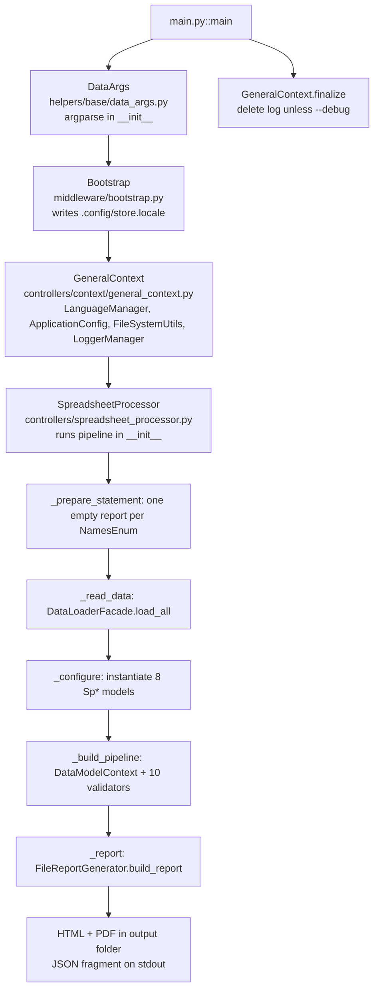
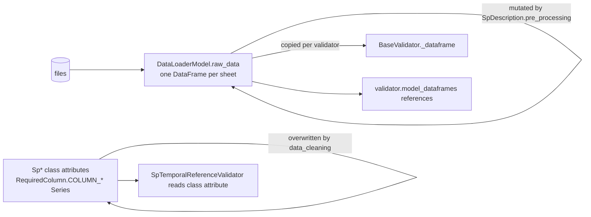

# Current architecture (v0.7.65b732, as implemented)

This document describes the code **as it is**. Smells are tagged with backlog IDs from
`../quality/backlog/`. The target design is in `target-architecture.md`.

## Pipeline

### Execution order inside `SpreadsheetProcessor`

| Step | Method | What happens | Report bucket |
|---|---|---|---|
| 0 | `_prepare_statement` | `ValidationReport.add_by_name` for every `NamesEnum` title (fixed order in the report) | all |
| 1 | `_read_data` | `DataLoaderFacade(input_folder).load_all` → `raw_data_map: dict[str, DataLoaderModel]` + load errors; extracts `scenarios` from `cenarios.simbolo`; builds `model_configurations` (`scenario_exists_file`, `scenario_read_success`, `scenarios`, `legend_exists_file`, `legend_read_success`) | FS |
| 2 | `_configure` | For each class in `target_model_classes` (`SpDescription, SpComposition, SpValue, SpTemporalReference, SpProportionality, SpScenario, SpLegend, SpDictionary`) instantiate the model (which runs `initialize()` + `run()` in `__init__`), then copy `structural_errors/warnings` → FS and `data_cleaning_errors/warnings` → FC | FS, FC |
| 3 | `_build_pipeline` | `DataModelContext(context, initialized_models)`; instantiate validators in this order (each runs in `__init__`): `FileStructureValidator`, `SpellCheckerValidator`, `SpDescriptionValidator`, `SpCompositionGraphValidator`, `SpCompositionTreeValidator`, `SpTemporalReferenceValidator`, `SpProportionalityValidator`, `SpValueValidator`, `SpScenarioValidator`, `SpLegendValidator` | per `NamesEnum` |
| 4 | `_report` | debug dump to logger; `FileReportGenerator(context).build_report(validation_reports)` | — |

## Components

### Entry and context

| Component | File | Responsibility | Smells |
|---|---|---|---|
| `main()` | `data_validate/main.py` | Wires `DataArgs → Bootstrap → GeneralContext → SpreadsheetProcessor → finalize`; prints welcome banner at import | ARC-012, SEC-008 |
| `DataArgs`, `DataFile`, `DataAction`, `DataReport` | `helpers/base/data_args.py` | argparse definition and validation; `allow_abbrev=True` makes `--i/--o/--l` work | ARC-001, ARC-011, BUG-009 |
| `Bootstrap` | `middleware/bootstrap.py` | Validates `--locale`, persists it to `./.config/store.locale` (relative to CWD) using a thread pool | BUG-004, BUG-008 |
| `GeneralContext` | `controllers/context/general_context.py` | Holds `data_args`, `language_manager`, `config`, `file_system_utils`, `logger_manager`, `logger`; disables logger unless `--debug`; `finalize()` deletes the log file | ARC-006, BUG-021 |
| `DataModelContext` | `controllers/context/data_model_context.py` | Holds initialized models; `get_instance_of(cls)` linear `isinstance` scan | ARC-006 |
| `ApplicationConfig` | `config/application_config.py` | Constants (`TITLE_OVER_N_CHARS=40`, `SIMPLE_DESCRIPTIONS_OVER_N_CHARS=150`, `REPORT_LIMIT_N_MESSAGES=20`, `VALUE_DATA_UNAVAILABLE="DI"`, `LABEL_DATA_UNAVAILABLE="Dado indisponível"`, `PRECISION_DECIMAL_PLACE_TRUNCATE=3`, `DATE_NOW`, `CURRENT_YEAR`), fallback HTML template, `get_verify_names()` | BUG-011, PERF-004 |
| `NamesEnum` | `config/names_enum.py` | 34 verification keys → i18n keys `verification_name_*` | — |
| `SpreadsheetInfo` / `SHEET` | `config/spreadsheet_info.py` | Sheet stems, `.csv/.xlsx`, `EXPECTED_FILES`, `OPTIONAL_FILES` | ARC-003 |
| `MetadataInfo` / `METADATA` | `config/metadata_info.py` | Version string from installed metadata + hand-maintained `serial` | BUG-017, TOOL-005 |

### Loading

| Component | File | Responsibility | Smells |
|---|---|---|---|
| `DataLoaderFacade.load_all` (property) | `helpers/tools/data_loader/api/facade.py` | Scan folder, pick reader + header strategy per stem, read into `DataLoaderModel`, collect read errors, fill missing sheets with empty models, add `data["qmls"]` | ARC-009, BUG-015 |
| `DataLoaderModel` | same file | `path`, `raw_data`, `is_read_successful`, `does_file_exist`, `header_type` | ARC-009 |
| `FileScanner.scan` | `.../engine/scanner.py` | Finds known stems; CSV silently wins over XLSX | BUG-015 |
| `ReaderFactory` | `.../engine/factory.py` | `.csv → CSVReader`, `.xlsx → ExcelReader`, `.qml → QMLReader` | — |
| `CSVReader`, `ExcelReader`, `QMLReader` | `.../readers/*.py` | `read_csv(sep from Config, dtype=str)` with MultiIndex forward-fill; `read_excel(engine="calamine", dtype=str)`; `read_text()` | BUG-018, SEC-003 |
| `SingleHeaderStrategy`, `DoubleHeaderStrategy` | `.../strategies/header.py` | `header=0` or `[0, 1]` | — |
| `Config` (singleton) | `.../common/config.py` | `file_specs = {stem: (required, "single"/"double", "|")}`, extensions incl. `.qml` | ARC-003 |

### Models (`data_validate/models/`)

All inherit `SpModelABC` (`sp_model_abc.py`): `__init__` stores context/data model/kwargs, then
`initialize()` (dedupe scenarios, empty-file error, `|` check, unnamed-column check) and the
subclass `__init__` calls `run()` → `pre_processing() → expected_structure_columns() →
data_cleaning() [→ post_processing()]` when the file exists. Results go to `structural_errors/
warnings` and `data_cleaning_errors/warnings`. Column definitions are nested classes of
`pd.Series` (`RequiredColumn`, `OptionalColumn`, `DynamicColumn`, `PluralColumn`).

| Model | Sheet | Specific behaviour | Smells |
|---|---|---|---|
| `SpDescription` | `descricao` | Dynamic `cenario`/`legenda` columns depend on scenario/legend files; injects `relacao=1`, `unidade=""`; cleans `codigo`, `nivel` (min 1), `cenario` (min −1), `legenda` (min 1, empty allowed) and **stores cleaned Series on the class** | BUG-002, BUG-003 |
| `SpComposition` | `composicao` | Cleans `codigo_pai`, `codigo_filho` (min 1) into class attributes | BUG-002 |
| `SpValue` | `valores` | Columns must match `^\d+-\d{4}(-SCENARIO)?$`; `id` required | BUG-013 |
| `SpTemporalReference` | `referencia_temporal` | Without scenarios the sheet must have exactly one row; cleans `simbolo` (min 0) into class attribute | BUG-002 |
| `SpProportionality` | `proporcionalidades` | Double header; level-0 and level-1 pattern checks; on structural error blanks the frame and sets `header_type="invalid"` | ARC-009 |
| `SpScenario` | `cenarios` | Duplicate `simbolo` detection | — |
| `SpLegend` | `legenda` | `data_cleaning` runs `LegendProcessing` per legend code (sequence, dtypes, labels, colour, decimals, min/max continuity, order) only if `is_sanity_check_passed` | — |
| `SpDictionary` | `dicionario` | Reads first column as `words_to_ignore` | — |

### Validators (`data_validate/validators/`)

All inherit `BaseValidator` (`spreadsheets/base/base_validator.py`): resolve the model from
`DataModelContext`, copy its frame, compute `TITLES_INFO = config.get_verify_names()`, then
`run()` builds a list of `(callable, NamesEnum.value)` and `build_reports()` executes each,
extending `ValidationReport` and catching **any** exception into an error message.

| Validator | Rules (method → NamesEnum) | Smells |
|---|---|---|
| `FileStructureValidator` | `validate_all_general_structure → FS` (empty dir, unexpected files/folders, missing required, csv/xlsx conflict) | BUG-026 |
| `SpellCheckerValidator` | `validate_spellchecker(SpDescription/SpTemporalReference/SpScenario) → SPELL` via `SpellChecker` (pyenchant) | BUG-022, BUG-023 |
| `SpDescriptionValidator` | `HTML_DESC, SC, CO_UN, INP, IL, MAND_PUNC_DESC, EF, LB_DESC, SIMP_DESC_N, TITLES_N` | PERF-001 |
| `SpCompositionGraphValidator` | `IR` (codes in description), `IR` (cycles, disconnected), `UT` (unique titles per subtree, root `"1"`), `LEAF_NO_DATA` | BUG-019 |
| `SpCompositionTreeValidator` | `TH` (level hierarchy + cycles via `TreeProcessing`), `CHILD_LVL` | PERF-001 |
| `SpTemporalReferenceValidator` | `MAND_PUNC_TEMP, YEARS_TEMP, UVR_TEMP` | BUG-002, BUG-007 |
| `SpProportionalityValidator` | `IR, REP_IND_PROP, IND_VAL_PROP, IR_PROP, SUM_PROP` | BUG-006 |
| `SpValueValidator` | `IR, VAL_COMB, UNAV_INV` | BUG-001, BUG-014 |
| `SpScenarioValidator` | `MAND_PUNC_SCEN, UVR_SCEN` | — |
| `SpLegendValidator` | `LEG_REL, LEG_RANGE` | PERF-001 |

Helpers used by validators live in `helpers/common/` (`validation/*Processing`,
`processing/*Processing`, `formatting/*Processing`, `generation/CombinationsProcessing`) as
static-method namespaces (ARC-007).

### Reporting

| Component | File | Responsibility | Smells |
|---|---|---|---|
| `TestReportItem`, `ValidationReport` | `controllers/report/validation_report.py` | Ordered dict of `test_name → (errors, warnings, was_executed)`; `flatten(n)` truncates and adds the "omitted" message | BUG-005, BUG-020 |
| `FileReportGenerator` | `controllers/report/file_report_generator.py` | Loads `static/report/report_template.html` (regex-validated against the fallback), builds HTML strings for errors/warnings, renders Jinja2 **without autoescape**, writes `<input-folder-name>_report.html`, converts to PDF with `pdfkit`, prints `<{json}>` | SEC-001, SEC-002, BUG-010 |

### Cross-cutting

| Concern | Implementation | Smells |
|---|---|---|
| i18n | `LanguageManager` reads `<repo>/.config/store.locale`, loads `static/locales/<lang>/messages.json`; `text(key, **kwargs)`; used by only two components — everything else is hard-coded pt-BR | ARC-005, BUG-004, BUG-016 |
| Logging | `LoggerManager` (console + file, colour formatter); file removed unless `--debug` | BUG-021 |
| Spell-check | `SpellChecker → DictionaryManager (enchant Broker, ENCHANT_CONFIG_DIR = static/dictionaries)`, `SpellCheckerController`, `TextProcessor`, `DataFrameProcessor` | ARC-015, BUG-022 |
| Errors as data | `list[str]` of pre-formatted messages everywhere | ARC-004 |

## Data ownership and mutation

The same `raw_data` object is shared by all validators; models mutate it (BUG-003) and overwrite
class-level column definitions (BUG-002). This is the main obstacle to testing and parallelism.

## Files and folders written at runtime

| Path | When | Smell |
|---|---|---|
| `./.config/store.locale` (CWD) and `<repo>/.config/store.locale` | every run | BUG-004 |
| `data/output/logs/data_validate_<ts>.log` (CWD) | every run, deleted unless `--debug` | BUG-021 |
| `<output>/<input-name>_report.html`, `.pdf` | every run | — |
| `<package>/static/dictionaries/<lang>.dic|.exc` | spell-check with user words | BUG-022 |

Last synced with code: 3dcfdb1
