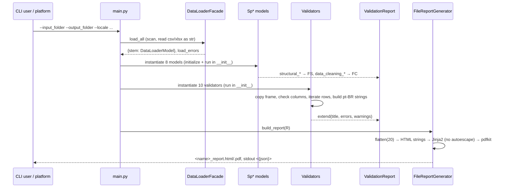

# Data flow — from file to message

## Today



Message anatomy today: `f"{filename}, linha {idx + 2}: {portuguese text with values}"` where
`idx` is the 0-based DataFrame index (single header → +2, double header → +3). Strings are
final at creation; the report only groups them under the `NamesEnum` title.

## Target

```mermaid
flowchart LR
  F[(bundle folder)] --> S[SheetLoader<br/>scan + read]
  S --> LR[LoadResult<br/>LoadedSheet per spec + STRUCT issues]
  LR --> N[Normalizer<br/>one pass: typed columns, invalid masks]
  N --> SF[SheetFrame per sheet]
  SF --> E[RuleEngine<br/>prerequisites, order, parallel groups]
  E --> O[RuleOutcome list<br/>Issue(rule_id, severity, sheet, row, column, key, params)]
  O --> RM[ReportModel<br/>group by category, sort, truncate 20, count]
  RM --> C[MessageCatalog<br/>key + params → localised text]
  C --> H[HTML renderer<br/>Jinja2 autoescape]
  C --> J[JSON renderer]
  C --> T[Console renderer]
  H --> P[PDF renderer<br/>optional]
```

### Row numbering

`Issue.row` is always the **spreadsheet row as the user sees it** (1-based, header rows
included). The conversion from DataFrame index is done once by `util.excel_row(index, header)`
during normalisation/rule execution, never by hand in rules.

### Where state lives

| Stage | Input | Output | Mutable? |
|---|---|---|---|
| Load | folder | `LoadResult` | no |
| Normalize | `LoadedSheet` | `SheetFrame` (raw + typed + masks) | no |
| Rules | `RuleContext` | `Issue` iterables | no |
| Report model | outcomes | `ReportModel` | no |
| Render | `ReportModel` | files / strings | writes only to the output folder |

### Error propagation

| Situation | Today | Target |
|---|---|---|
| Missing required file | FS error string | `STRUCT-002` issue, dependent rules skipped with reason |
| Unreadable file (encoding, parser) | FS error string; empty frame | `STRUCT-004` issue, `readable=False`, dependents skipped |
| Missing column | each validator checks and emits abort string | engine checks `requires`, emits one `engine.skipped.missing_column` per rule |
| Non-numeric cell in integer column | FC error + row dropped in every re-clean | `Normalizer` emits `STRUCT-010` once; `invalid` mask lets rules ignore the cell |
| Rule raises | caught, rendered as "Exception validation …" | `engine.rule_crashed` + exit code 2 |

Last synced with code: 3dcfdb1
