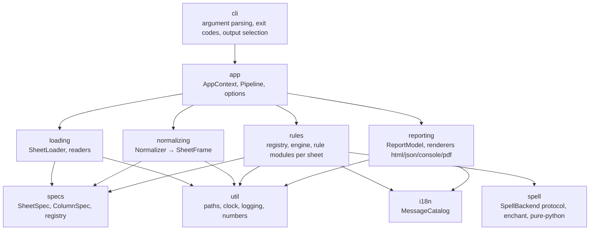

# Target architecture

Design goal: pure rules over immutable typed sheets, explicit dependencies, structured issues,
one source of truth for sheet definitions, zero global state, renderers as plugins. The migration
path is in `../quality/backlog/08-migration-roadmap.md`; decisions are recorded as ADRs 0002–0008
and 0013.

## Layers



Allowed imports (enforced by `.claude/rules/architecture-boundaries.md` and a future
import-linter contract): `cli → app`; `app → loading, normalizing, rules, reporting`;
`loading/normalizing/rules/reporting → specs, i18n, util`; `rules → spell`; `specs, i18n, util,
spell` import nothing from the other layers.

Package layout:

```
data_validate/
  cli.py                 # entry point `canoa-data-validate`
  app/                   # AppContext, Options, Pipeline, ValidationResult
  specs/                 # SheetSpec registry (the only place sheet names/columns/headers live)
  loading/               # SheetLoader, readers (csv, xlsx), LoadResult
  normalizing/           # Normalizer, SheetFrame, typed columns, invalid masks
  rules/                 # engine.py, registry.py, <sheet>/<RULE_ID>.py
  reporting/             # ReportModel, html.py, json.py, console.py, pdf.py (optional extra)
  i18n/                  # MessageCatalog, locales/*.json
  spell/                 # SpellBackend, EnchantBackend, PurePythonBackend
  util/                  # clock, paths, numbers, logging
  static/                # templates, css, dictionaries
```

## Core interfaces

```python
# specs
@dataclass(frozen=True)
class ColumnSpec:
    name: str                      # "codigo"
    kind: Literal["int", "float", "str", "pattern"]
    required: bool = True
    min_value: int | None = None
    allow_empty: bool = False
    pattern: str | None = None     # e.g. r"^\d+-\d{4}(-(?P<scenario>\w+))?$"

@dataclass(frozen=True)
class SheetSpec:
    key: str                       # "descricao"
    required: bool
    header: Literal["single", "double"]
    csv_separator: str = "|"
    columns: tuple[ColumnSpec, ...] = ()
    dynamic_columns: tuple[ColumnSpec, ...] = ()   # present only with scenarios/legend
    optional_columns: tuple[ColumnSpec, ...] = ()

SHEETS: Mapping[str, SheetSpec]   # registry; FileStructure rules, loader and normalizer derive from it

# loading
@dataclass(frozen=True)
class LoadedSheet:
    spec: SheetSpec
    path: Path | None              # None when the file is absent
    frame: pd.DataFrame | None     # raw, all-string, None when unreadable
    issues: tuple[Issue, ...]      # read errors (STRUCT-*)

@dataclass(frozen=True)
class LoadResult:
    sheets: Mapping[str, LoadedSheet]
    unexpected_files: tuple[Path, ...]

class SheetLoader(Protocol):
    def load(self, folder: Path, options: LoadOptions) -> LoadResult: ...

# normalizing
@dataclass(frozen=True)
class SheetFrame:
    spec: SheetSpec
    raw: pd.DataFrame              # never mutated
    typed: pd.DataFrame            # nullable Int64/Float64/string[pyarrow]
    invalid: Mapping[str, pd.Series]   # column -> boolean mask of cells that failed typing
    exists: bool
    readable: bool

class Normalizer(Protocol):
    def normalize(self, sheet: LoadedSheet, ctx: RuleContext) -> tuple[SheetFrame, tuple[Issue, ...]]: ...

# errors (see error-model.md)
class Severity(StrEnum):
    ERROR = "error"
    WARNING = "warning"

@dataclass(frozen=True, slots=True)
class Issue:
    rule_id: str                   # "DESC-004"
    severity: Severity
    sheet: str | None              # "descricao.xlsx"
    row: int | None                # spreadsheet row (1-based, header-aware)
    column: str | None
    message_key: str               # "rule.DESC-004.error"
    params: Mapping[str, object] = field(default_factory=dict)

# rules
@dataclass(frozen=True)
class RuleContext:
    sheets: Mapping[str, SheetFrame]
    options: Options               # flags such as no_spellchecker, no_warning_titles_length
    catalog: MessageCatalog
    clock: Clock
    scenarios: tuple[str, ...]
    spell: SpellBackend | None

class Rule(Protocol):
    rule_id: str                   # unique, stable
    category: str                  # NamesEnum-compatible report bucket
    requires: Mapping[str, tuple[str, ...]]   # {"descricao": ("codigo", "nivel")}
    depends_on: tuple[str, ...]    # rule IDs that must have produced no error
    def check(self, ctx: RuleContext) -> Iterable[Issue]: ...

@dataclass(frozen=True)
class RuleOutcome:
    rule_id: str
    status: Literal["executed", "skipped"]
    reason: str | None             # message key when skipped
    issues: tuple[Issue, ...]
    duration_ms: float

# reporting
class Renderer(Protocol):
    format: str                    # "html" | "json" | "console" | "pdf"
    def render(self, model: ReportModel, target: Path | None) -> Path | str: ...

# spell
class SpellBackend(Protocol):
    language: str
    def check(self, word: str) -> bool: ...
    def add_session_words(self, words: Iterable[str]) -> None: ...
```

## Rule engine semantics

1. **Registration**: every rule module registers one `Rule` in `rules/registry.py` with a unique
   `rule_id`; the registry is the list shown by `--list-rules` and rendered in the report in a
   fixed order (category order = today's `NamesEnum` order).
2. **Prerequisites**: before `check()`, the engine verifies `requires` (sheet exists, readable,
   columns present) and `depends_on` (no error issues from those rules). If unmet, the rule is
   reported as **skipped with reason** (`RuleOutcome.status == "skipped"`, reason = catalog key
   such as `engine.skipped.missing_column`). This replaces today's per-validator column checks and
   the unused `set_not_executed` placeholder.
3. **Purity**: `check()` receives an immutable `RuleContext` and returns issues; it never mutates
   frames, never performs I/O, never reads globals. This makes rules unit-testable with in-memory
   frames and safe to run concurrently.
4. **Ordering**: topological on `depends_on`; ties keep registry order. Independent groups may
   run in a `ProcessPoolExecutor` when `Options.parallel` is set (PERF-007); output order is
   deterministic regardless.
5. **Failure isolation**: an unexpected exception inside a rule is recorded as an
   `engine.rule_crashed` issue **and** makes the process exit with code 2 (never silently 0).
6. **Truncation** happens only in reporting (`ReportModel`), never in the engine.

## Pipeline

```python
def validate(folder: Path, options: Options) -> ValidationResult:
    ctx = AppContext.build(options)                  # locale, catalog, clock, logger, spell
    loaded = SheetLoader().load(folder, options)
    frames, norm_issues = Normalizer().normalize_all(loaded, ctx)
    outcomes = RuleEngine(registry).run(RuleContext(frames, ...))
    return ValidationResult(loaded, norm_issues, outcomes)
```

`cli.main()` maps `ValidationResult` to renderers and exit codes (see `../api/cli-contract.md`).

## Current module → target module

| Current | Target | Notes |
|---|---|---|
| `main.py` | `cli.py` | banner removed; `main()` returns exit code |
| `helpers/base/data_args.py` | `cli.py` + `app/options.py` | argparse with explicit aliases; `Options` frozen dataclass |
| `middleware/bootstrap.py` | — (deleted) | locale is an option (ADR-0005) |
| `controllers/context/general_context.py` | `app/context.py` (`AppContext`) | no file/env side effects |
| `controllers/context/data_model_context.py` | `rules/context.py` (`RuleContext`) | mapping by sheet key |
| `controllers/spreadsheet_processor.py` | `app/pipeline.py` | explicit `run`, no work in `__init__` |
| `controllers/report/validation_report.py` | `app/result.py` (`ValidationResult`, `RuleOutcome`) + `reporting/model.py` | truncation in reporting |
| `controllers/report/file_report_generator.py` | `reporting/html.py`, `reporting/pdf.py`, `reporting/json.py`, `reporting/console.py` | autoescape; PDF optional |
| `config/application_config.py` | `app/options.py` + `specs/limits.py` | constants become options/limits; `DATE_NOW` → `Clock` |
| `config/names_enum.py` | `rules/categories.py` | category order preserved for report compatibility |
| `config/spreadsheet_info.py`, `helpers/tools/data_loader/common/config.py` | `specs/sheets.py` | single registry |
| `config/metadata_info.py` | `util/version.py` | `importlib.metadata` only |
| `helpers/tools/data_loader/api/facade.py` | `loading/loader.py` | `LoadResult` |
| `helpers/tools/data_loader/engine/{scanner,factory}.py` | `loading/scan.py`, `loading/readers/__init__.py` | conflict policy from spec |
| `helpers/tools/data_loader/readers/{csv,excel}_reader.py` | `loading/readers/{csv,xlsx}.py` | size limits, pyarrow strings |
| `helpers/tools/data_loader/readers/qml_reader.py` | — (deleted unless protocol requires QML) | `future/open-questions.md` |
| `helpers/tools/data_loader/strategies/header.py` | `specs/SheetSpec.header` | — |
| `helpers/tools/locale/{language_manager,language_enum}.py` | `i18n/catalog.py`, `i18n/locale.py` | no file persistence |
| `helpers/base/file_system_utils.py` | `util/paths.py` | exceptions instead of tuples |
| `helpers/base/logger_manager.py` | `util/logging.py` | `dictConfig`, handlers closed |
| `helpers/base/constant_base.py` | — (frozen dataclasses) | — |
| `helpers/common/formatting/number_formatting_processing.py` | `util/numbers.py` | vectorised helpers |
| `helpers/common/formatting/text_formatting_processing.py` | `rules/description/_text.py` | — |
| `helpers/common/formatting/message_formatting_processing.py` | — (catalog) | — |
| `helpers/common/generation/combinations_processing.py` | `rules/values/_combinations.py` | — |
| `helpers/common/processing/collections_processing.py` | `specs/patterns.py` + `util/collections.py` | ID pattern compiled once from spec |
| `helpers/common/processing/data_cleaning_processing.py` | `normalizing/normalizer.py` | one pass per sheet |
| `helpers/common/validation/dataframe_processing.py` | `rules/structure/*.py` (`STRUCT-*`) + `normalizing/` | — |
| `helpers/common/validation/character_processing.py` | `rules/_shared/text_checks.py` | vectorised |
| `helpers/common/validation/description_processing.py` | `rules/description/_codes.py` | — |
| `helpers/common/validation/graph_processing.py` | `rules/composition/_graph.py` | `nx.from_pandas_edgelist` |
| `helpers/common/validation/tree_processing.py` | `rules/composition/_graph.py` | merged with graph |
| `helpers/common/validation/legend_processing.py` | `rules/legend/*.py` | one rule per check |
| `helpers/common/validation/proportionality_processing.py` | `rules/proportionality/*.py` | — |
| `helpers/common/validation/value_processing.py` | `rules/values/*.py` | vectorised |
| `helpers/tools/spellchecker/*` | `spell/` | `SpellBackend` |
| `helpers/tools/readme/generate_readme.py` | — (deleted, ADR-0009) | — |
| `models/sp_model_abc.py`, `models/sp_*.py` | `specs/sheets.py` (definitions) + `normalizing/` (cleaning) + `rules/structure/` (checks) | models disappear as classes |
| `validators/structure/file_structure_validator.py` | `rules/structure/STRUCT-00x.py` | — |
| `validators/spell/spellchecker_validator.py` | `rules/spelling/SPELL-00x.py` | — |
| `validators/spreadsheets/base/base_validator.py` | `rules/engine.py` | prerequisites centralised |
| `validators/spreadsheets/<sheet>/*_validator.py` | `rules/<sheet>/<RULE-ID>.py` | one rule per module |
| `static/locales/*/messages.json` | `i18n/locales/*.json` | keyed by rule ID |
| `static/report/*`, `static/dictionaries/*`, `static/templates/README.TEMPLATE.md` | `static/report/*`, `static/dictionaries/*`, — | template generator retired |

## Non-goals of the target design

- No plugin loading from arbitrary paths (rules ship with the package; sector-specific rule packs
  are a `future/ideas.md` item).
- No change to the report's visual identity during Phases 1–3 (goldens must stay identical).

Last synced with code: 09279f4
