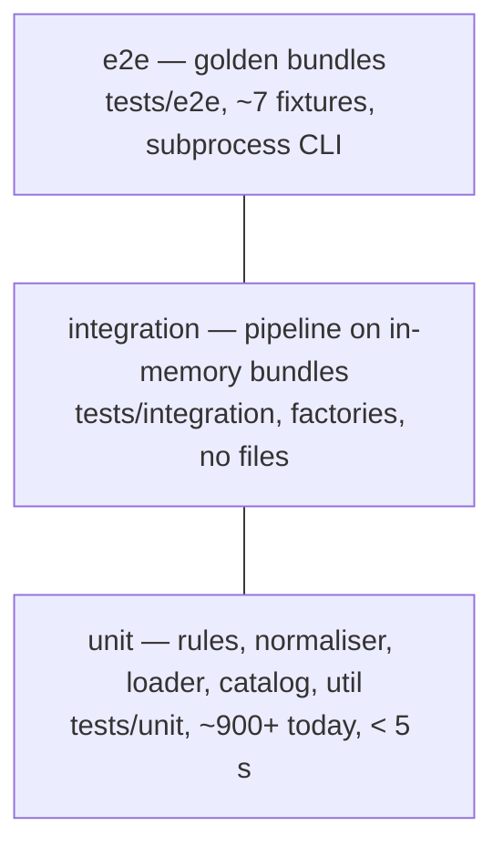

# Testing strategy

Framework: **pytest + pytest-mock** only (`unittest.mock` is forbidden, see
`.claude/rules/testing.md`). Tests mirror the package tree under `tests/`.

## Pyramid

| Layer | Marker | Runs in | Speed budget |
|---|---|---|---|
| Unit | `unit` (default) | every commit, pre-commit stop hook | < 10 s total |
| Integration | `integration` | `make test`, CI | < 30 s |
| End-to-end / golden | `e2e` | `make test-e2e`, CI Linux job | < 2 min |
| Benchmarks | `slow` | `make bench`, nightly/optional | reported, thresholded |

Optional dependencies: `requires_enchant` (real hunspell), `requires_pdf` (wkhtmltopdf /
WeasyPrint). Tests with these markers skip with a clear reason when the backend is absent.

## Fixtures (`tests/conftest.py`)

| Fixture | Purpose |
|---|---|
| `repo_root` | `Path` of the repository |
| `fixture_folder(name)` | `data/input/<name>` |
| `tmp_cwd` (autouse) | `monkeypatch.chdir(tmp_path)` so no test writes `.config/`, `data/output/logs` in the repo; opt-out with `@pytest.mark.keep_cwd` |
| `app_context` (target) | `AppContext` with fake catalog (returns keys), frozen clock, null logger |
| `sheet_bundle` / `BundleBuilder` (target, `tests/factories.py`) | Minimal valid bundle as DataFrames with helpers to inject one defect |
| `catalog` | Real pt_BR catalog for message rendering tests |
| `freeze_clock` | Fixed `datetime` for date-dependent rules (`TEMP-*`) |

## Golden harness (`tests/e2e/`)

- Fixtures: every folder in `data/input/` (`data_ground_truth_01` must yield 0 errors;
  `data_errors_01,09,11,13,14,15` yield known errors).
- `test_golden.py` runs the CLI via `subprocess` with
  `--no-time --no-version --sector "Setor A" --protocol "Protocolo B" --user "Usuário C"`,
  parses the HTML with `html.parser`, extracts `{category: {errors: [...], warnings: [...]}}` and
  the stdout JSON, normalises (strip, stable order) and compares with
  `tests/e2e/golden/<fixture>.json`.
- Spell-check: when enchant is unavailable the `SPELL` category is dropped from both sides and
  the golden records `"spell_skipped": true`.
- Update **only** via `make harness-update` (`pytest tests/e2e --update-golden`), with the reason
  appended to `tests/e2e/golden/CHANGELOG.md` and the diff reviewed in the PR.
- Stability requirement: three consecutive runs produce identical goldens.

## Coverage

- Baseline 55.97 % (2026-08-25). `tools/coverage_ratchet.py` stores the last accepted value
  in `dev-reports/coverage-baseline.txt` (committed as `.coverage-baseline`) and fails CI if the
  new run is lower.
- Targets: 70 % end of Phase 1, 85 % end of Phase 3, ≥ 90 % at 1.0.0.
- New modules: ≥ 95 % lines and branches; every bug fix ships a regression test named after
  the backlog ID (`test_bug_006_missing_id_column_does_not_raise`).
- `exclude_lines` contains only `pragma: no cover`, `if TYPE_CHECKING:`, `raise NotImplementedError`,
  `@abstractmethod`, `if __name__ == "__main__":`.

## Rule tests (Phase 3 onward)

One module per rule: `tests/unit/rules/<sheet>/test_<RULE-ID>.py` with a `cases` table
(`id, bundle_mutation, expected_issues`) parametrised over: valid input, each failure mode,
missing column (→ skipped), empty sheet, `DI` values, with/without scenarios. Assertions target
`Issue.rule_id/row/column/params`, never rendered text.

## Property-based and mutation testing

- `hypothesis` strategies for cells (numbers with `,`/`.`, blanks, `DI`, unicode), CSV/XLSX
  round-trips, legend intervals, `CODE-YEAR-SCENARIO` strings.
- `mutmut` on `data_validate/rules/` once per release to find untested branches.

## CI

Jobs `test` (matrix ubuntu-24.04/windows-2022 × 3.12/3.13, `pytest -n auto --cov`, Codecov,
junit artefact) and `e2e` (Linux, system deps installed). See `../infrastructure/ci-cd.md`.

Last synced with code: 3dcfdb1
