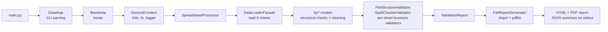

# How It Works

`canoa-data-validate` reads a bundle of spreadsheets (`descricao`, `composicao`, `valores`,
`referencia_temporal` required; `proporcionalidades`, `cenarios`, `legenda`, `dicionario`
optional), loads and structurally checks each sheet into a model, runs 34 structural and
business-rule validators defined by Protocol v1.13, aggregates the results into a
`ValidationReport`, and renders an HTML/PDF report plus a one-line JSON summary on stdout that
the AdaptaBrasil platform consumes.

The project is mid-migration (strangler fig) to a layered target architecture (`cli` → `app` →
`loading`/`normalizing` → `rules` → `reporting`/`i18n`, all reading a single `SheetSpec`
registry) that keeps this contract green at every step — see
`.specs/quality/backlog/08-migration-roadmap.md`.

## Where to read more

- Pipeline as implemented today: [`.specs/architecture/current-architecture.md`](.specs/architecture/current-architecture.md)
- Target architecture: [`.specs/architecture/target-architecture.md`](.specs/architecture/target-architecture.md)
- Data flow (file → message): [`.specs/architecture/data-flow.md`](.specs/architecture/data-flow.md)
- CLI contract and JSON schema: [`.specs/api/cli-contract.md`](.specs/api/cli-contract.md)
- Business rules per sheet: [`.specs/business-rules/README.md`](.specs/business-rules/README.md)

See also [README.md](README.md) and [TESTING.md](TESTING.md).
