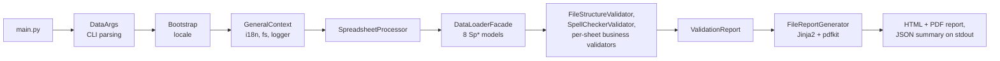

# Data Validate

<p>
  <a href="https://github.com/AdaptaBrasil/data_validate/actions/workflows/ci.yml"></a>
  <a href="https://codecov.io/gh/AdaptaBrasil/data_validate"></a>
  <a href="https://pypi.org/project/canoa-data-validate/"></a>
  <a href="LICENSE"></a>
  
</p>

**Data Validate** (PyPI package `canoa-data-validate`, codename *Canoa*) is the spreadsheet
validator of the **AdaptaBrasil** climate-adaptation platform, developed by INPE (Instituto
Nacional de Pesquisas Espaciais). Sector data teams (health, biodiversity, water, …) submit a
bundle of spreadsheets describing climate-adaptation indicators; Data Validate checks that
bundle against *Protocolo v1.13* — structure, hierarchy, codes, value patterns, legends,
proportionality sums, temporal references, scenarios, and pt-BR/en-US spelling — and produces an
HTML/PDF report plus a machine-readable JSON summary that the platform's ingestion pipeline
consumes.

Who it's for: sector data teams preparing an AdaptaBrasil submission, the platform's CI/ingestion
pipeline (batch usage), and INPE maintainers/researchers extending the rule set.

## Installation

### End users

```bash
pipx install canoa-data-validate
canoa-data-validate --input_folder data/input --output_folder data/output --locale pt_BR
```

(`pip install canoa-data-validate` inside a virtualenv also works if you don't use `pipx`.)

### Developers

```bash
git clone https://github.com/AdaptaBrasil/data_validate.git
cd data_validate
make setup   # poetry install --sync + pre-commit install
```

### System dependencies (all optional)

Data Validate works without any of these — they only unlock spell-check and PDF output.

| Feature | Linux (Debian/Ubuntu) | Windows |
|---|---|---|
| Spell-check (`SPELL` category) | `sudo apt install enchant-2 hunspell-pt-br hunspell-en-us` | bundled hunspell dictionaries, or run under WSL |
| PDF report | `sudo apt install wkhtmltopdf` | `choco install -y wkhtmltopdf`, or download from <https://wkhtmltopdf.org/downloads.html> |

Without `wkhtmltopdf`, PDF generation is skipped with a stderr message and the HTML report is
still produced. Without `enchant`, spell-check tests/rules skip with a clear reason.

## Usage

```bash
canoa-data-validate \
  --input_folder data/input/data_ground_truth_01 \
  --output_folder data/output/data_ground_truth_01 \
  --locale pt_BR \
  --sector "Biodiversidade" \
  --protocol "Protocolo v1.13" \
  --user "Researcher Name" \
  --debug
```

Or without installing the package: `python -m data_validate.main --input_folder data/input ...`.

| Flag | Type / default | Notes |
|---|---|---|
| `--input_folder PATH` | required | Existing directory holding the spreadsheet bundle |
| `--output_folder PATH` | `output_data/` | Created if missing; basename must not contain a dot |
| `--locale`, `-l` | `pt_BR` \| `en_US`, default `pt_BR` | Report and message language |
| `--no-spellchecker` | flag | Skip the spell-check category |
| `--no-warning-titles-length` | flag | Skip the title-length warning category |
| `--no-time` | flag | Hide date/time in the report and stdout |
| `--no-version` | flag | Hide the validator version/OS line in the report |
| `--debug` | flag | Verbose logging; keeps the log file |
| `--sector`, `--protocol`, `--user`, `--file` | optional text | Shown in the report header |

**Outputs:** `<output_folder>/<input-folder-name>_report.html`, the same `.pdf` (unless
`wkhtmltopdf` is unavailable), and a one-line JSON summary on stdout, e.g.
`{"data_validate": {"version": "0.7.65...", "report": {"errors": 0, "warnings": 3, "tests": 34}}}`.

**Exit code:** today the process **always exits 0**, regardless of validation result — the
platform reads pass/fail from the JSON summary, not the exit code (tracked as `SEC-008`). A
target contract with explicit exit codes (`0` clean, `1` issues found, `2` tool failure), a
`--json`/`--format` flag, and deprecation of the abbreviated flags is specified in
[`.specs/api/cli-contract.md`](.specs/api/cli-contract.md) and lands per
[`docs/adrs/0005-cli-contract-flags-exit-codes-json.md`](docs/adrs/0005-cli-contract-flags-exit-codes-json.md).

## Input format

Sheets are `.csv` (`|`-separated) or `.xlsx`; the same stem must not exist in both formats.

| Sheet | Required | Header | Key columns | Spec |
|---|---|---|---|---|
| `descricao` | yes | single | `codigo`, `nivel`, `nome_simples/completo`, `desc_simples/completa` | [description.md](.specs/business-rules/description.md) |
| `composicao` | yes | single | `codigo_pai`, `codigo_filho` | [composition.md](.specs/business-rules/composition.md) |
| `valores` | yes | single | `id`, `CÓDIGO-ANO[-CENÁRIO]` value columns | [values.md](.specs/business-rules/values.md) |
| `referencia_temporal` | yes | single | `simbolo` (year) | [temporal-reference.md](.specs/business-rules/temporal-reference.md) |
| `proporcionalidades` | no | double | `id`, parent/child `MultiIndex` weights | [proportionality.md](.specs/business-rules/proportionality.md) |
| `cenarios` | no | single | `simbolo` (scenario code) | [scenarios.md](.specs/business-rules/scenarios.md) |
| `legenda` | no | single | `codigo`, `minimo`, `maximo`, `label`, `cor` | [legend.md](.specs/business-rules/legend.md) |
| `dicionario` | no | single | first column: words accepted by spell-check | [spelling.md](.specs/business-rules/spelling.md) |

Full folder/file rules (missing files, `.csv`/`.xlsx` conflicts, unexpected files) are in
[file-structure.md](.specs/business-rules/file-structure.md).

## Validations

~34 verification categories, each backed by one or more stable business-rule IDs
(`STRUCT-`, `CLEAN-`, `DESC-`, `COMP-`, `VAL-`, `TEMP-`, `SCEN-`, `LEG-`, `PROP-`, `SPELL-`).
Full traceability (protocol section → rule ID → code → test → message key) is in
[`.specs/business-rules/README.md`](.specs/business-rules/README.md); the table below is
generated from `data_validate/config/names_enum.py`.

| Category | Rule IDs |
|---|---|
| File structure | STRUCT-001…012, DESC-011/012, VAL-001, SCEN-001/002, PROP-001/002 |
| File cleaning | CLEAN-001…006, LEG-001…011 |
| Indicator relations | COMP-001…003, VAL-002, PROP-003 |
| Tree hierarchy | COMP-007, COMP-008 |
| Indicator levels | DESC-005 |
| Code uniqueness | DESC-003 |
| HTML codes in descriptions | DESC-001 |
| Spelling | SPELL-001…005 |
| Unique titles | COMP-004 |
| Sequential codes | DESC-002 |
| Empty fields | DESC-007 |
| Indicator name pattern | DESC-004 |
| Titles over 40 chars | DESC-010 |
| Simple descriptions over 150 chars | DESC-009 |
| Mandatory/prohibited punctuation — descriptions | DESC-006 |
| Mandatory/prohibited punctuation — scenarios | SCEN-003 |
| Mandatory/prohibited punctuation — temporal reference | TEMP-001 |
| Unique value relations — scenarios | SCEN-004 |
| Unique value relations — temporal reference | TEMP-003 |
| Value combination relations | VAL-003 |
| Unavailable/invalid values | VAL-004, VAL-005 |
| Line break in description | DESC-008 |
| Years in temporal reference | TEMP-002 |
| Legend data range | LEG-015 |
| Legend relations | LEG-012…014 |
| Sum of proportionality (influencing factors) | PROP-007…010 |
| Repeated indicators in proportionalities | PROP-004 |
| Indicator relations in proportionalities | PROP-006 |
| Indicators in values and proportionalities | PROP-005 |
| Leaf indicators without associated data | COMP-005, COMP-006 |
| Child indicator levels | COMP-009 |

Two categories (`LB_SCEN`, `LB_TEMP`, line-break checks for scenarios/temporal reference) and
one (`LEG_OVER`, legend overlap) are registered but never emit a message today (documented gaps
G-08 in the business-rules spec) — they still appear as empty sections in the report.

## Architecture



The codebase is mid-migration (strangler fig) toward a layered target design — `cli` → `app`
→ `loading`/`normalizing` → `rules` (registry, `Rule` protocol, `Issue` model) →
`reporting`/`i18n`, all reading a single `SheetSpec` registry — while the CLI/report/JSON
contract with the platform stays green at every step. See
[`.specs/architecture/current-architecture.md`](.specs/architecture/current-architecture.md),
[`target-architecture.md`](.specs/architecture/target-architecture.md), and the architecture
decision records in [`docs/adrs/`](docs/adrs/README.md).

## Development

```bash
make setup    # install deps + pre-commit hooks
make check    # lint + typecheck + security-offline + unit tests (fast local gate)
```

| Target | Description |
|---|---|
| `make setup` | `poetry install --sync` + install pre-commit hooks |
| `make lint` / `make format` | `ruff check` / `ruff format` |
| `make typecheck` | `mypy` (strict on `tools/`, `tests/e2e/`; legacy-exempt on `data_validate/`) |
| `make security` / `security-offline` | `bandit` (+ `pip-audit`, needs network) |
| `make test-unit` / `make test-e2e` / `make test` | unit / golden e2e / both |
| `make coverage` | coverage report + ratchet check |
| `make harness-update` | regenerate e2e goldens (review the diff!) |
| `make bench` / `make profile` | benchmarks / pipeline profiling |
| `make run FIXTURE=<name>` / `make run-all` | run the CLI against one/all `data/input/` fixtures |
| `make i18n-check` | message catalog parity check |
| `make build` / `make docs` / `make clean` | build package / generate API docs / clean artifacts |

Pre-commit (`.pre-commit-config.yaml`) runs hygiene checks, `ruff`, `mypy` (scoped), `bandit`,
`poetry-check --lock`, and `conventional-pre-commit` — no hook runs the application pipeline or
stages files on your behalf.

This project is developed with an AI-orchestrator, multi-agent workflow: standing conventions in
`.claude/rules/`, specialised subagents in `.claude/agents/`, slash-command workflows in
`.claude/commands/`. See [`CLAUDE.md`](CLAUDE.md) and the tool-agnostic
[`AGENTS.md`](AGENTS.md). Every behaviour/rule/contract change must update the matching file
under `.specs/` in the same commit (spec-sync, see
[`.claude/rules/spec-sync.md`](.claude/rules/spec-sync.md)).

## Testing

```bash
make test-unit        # fast, parallel unit tests
make test-e2e          # golden end-to-end harness over data/input/*
make harness-update     # regenerate goldens (reviewed diff, reason recorded)
```

pytest + pytest-mock only. Coverage is a ratchet (`fail_under = 54` today, only ever raised); new
modules require ≥ 95 %. Full strategy: [`TESTING.md`](TESTING.md) and
[`.specs/quality/testing-strategy.md`](.specs/quality/testing-strategy.md).

## Roadmap

The migration is tracked as a 90-item, prioritised backlog organised into six phases (safety net
→ foundations → loading/normalisation → rules engine → reporting/i18n → spell-check/performance/
release). See [`.specs/quality/backlog/README.md`](.specs/quality/backlog/README.md) and the
phase plan in [`08-migration-roadmap.md`](.specs/quality/backlog/08-migration-roadmap.md).

## Contributing

See [`CONTRIBUTING.md`](CONTRIBUTING.md) for the development workflow, branch/commit
conventions, and pull request checklist, and [`CODE_OF_CONDUCT.md`](CODE_OF_CONDUCT.md) for
community standards.

## Security

See [`SECURITY.md`](SECURITY.md) to report a vulnerability privately.

## License

[MIT](LICENSE) — Copyright (c) 2024-2026 National Institute for Space Research (INPE) of the
Brazilian Ministry of Science, Technology and Innovations.

## Authors

- **Pedro Andrade** — Coordinator — INPE
- **Mário de Araújo Carvalho** — Contributor and Developer — INPE
- **Mauro Assis** — Contributor — INPE
- **Miguel Gastelumendi** — Contributor — INPE

Developed for and with the **AdaptaBrasil** platform team.
